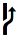
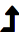
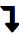
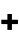

# `git`


This module displays information about the current git repository. If you are
not in a git repository, it is not shown. If the current branch is dirty, the
segment is yellow/orange by default. The dirty color can be changed by providing
an extra argument.

## Icons

Icon Name|Description|Nerd Fonts|Unicode|ASCII
-|-|:-:|:-:|:-:
github|remote points to [GitHub](https://github.com/)|
gitlab|remote points to [GitLab](https://gitlab.com/)|
bitbucket|remote points to [Bitbucket](https://bitbucket.org/)|
git|remote does not point to any of the above domains|
stash|a stash||&#x1f4e5;|#
ahead|you are a commit ahead of upstream||&#x2191;|>
behind|you are a commit behind upstream (requires a `git fetch`)||&#x2193;|<
modified|the branch has been modified||&#x25cf;|\*
staged|a file has been staged||&#x271a;|+

## Example

```sh
# "yellow" is the dirty color
SILVER+=(git:green:black:yellow)
```
